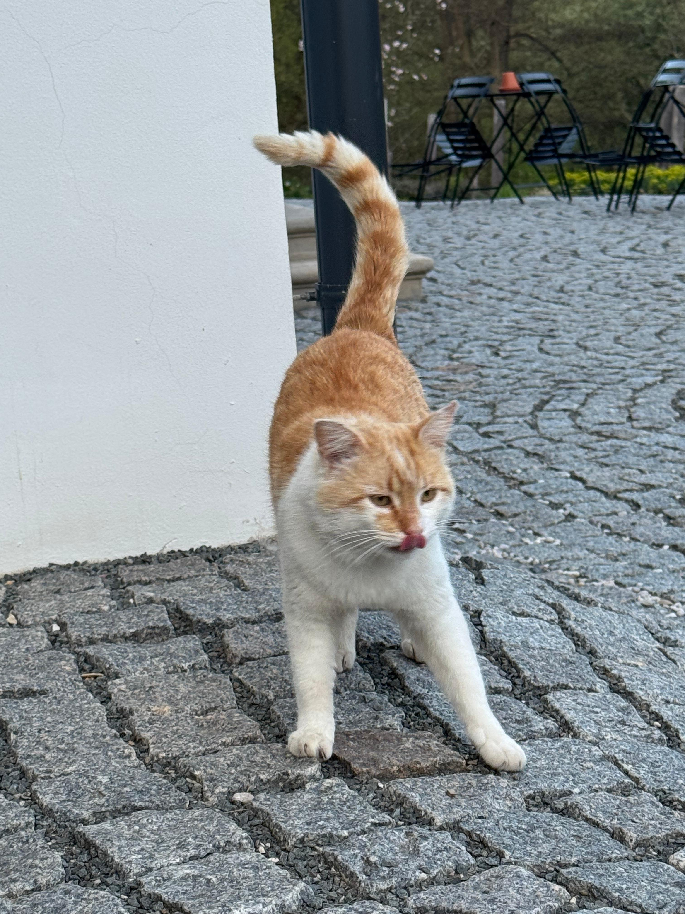
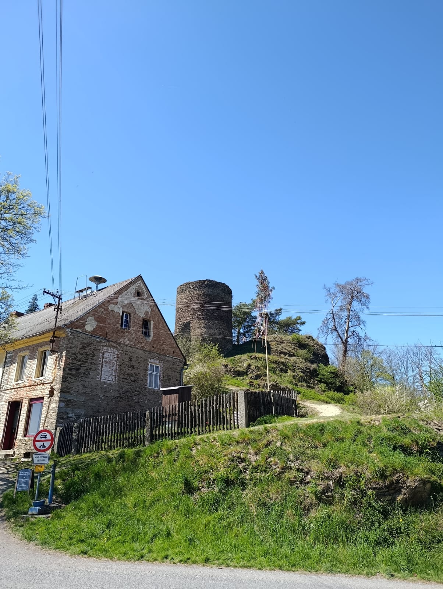
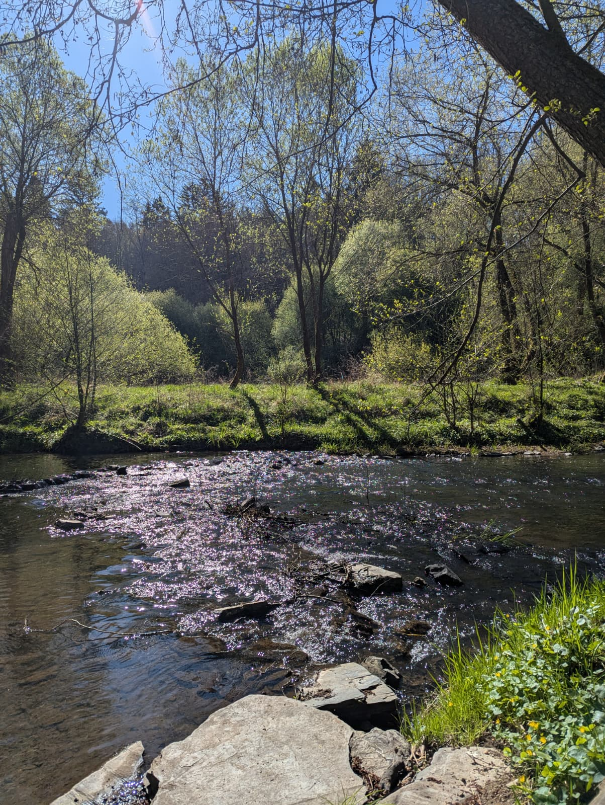

# 🏰 4-Burgen-Tour am Tauhaus · Rabštejn nad Střelou

> **Eine Rundtour durch Geschichte, Fluss und Frühling in Böhmen**

---

## 📋 Auf einen Blick

| Eigenschaft | Info |
|---|---|
| 🗺️ Start & Ziel | Tauhaus, Rabštejn nad Střelou 72, Manětín |
| ⏱️ Dauer | 90–120 Minuten |
| 🧭 Art | Rundtour |
| 🏔️ Charakter | Flussnähe · Historischer Ortskern · Burgen & Schloss · Aussichtspunkt |
| 👟 Schwierigkeit | Leicht bis mittel (ein Anstieg zum Aussichtspunkt) |
| 📅 Beste Zeit | Frühling und Herbst |
| 🌍 Region | Böhmen, Tschechien (nahe Manětín) |

---

## 🌿 Die Tour

Diese Rundtour startet direkt am **Tauhaus** – einem idyllischen Ferienhaus direkt an der Střela. Sie führt entlang des Flusses, durch den kleinsten historischen Ort Tschechiens, vorbei an Burgruinen, einem barocken Schloss und auf einen Aussichtspunkt mit Panoramablick ins Tal.

Das Besondere: Wer möchte, kann an mehreren Stellen barfuß durch die flache Střela waten – ein Highlight besonders bei warmem Wetter.

---

## 📸 Impressionen

<table>
  <tr>
    <td> <em>Střela im Frühling – Kirschblüten auf dem Wasser</em></td>
    <td> <em>Barfuß durch die Střela</em></td>
    <td> <em>Die historische Steinbrücke</em></td>
  </tr>
  <tr>
    <td> <em>Burgturm-Ruine von Rabštejn</em></td>
    <td> <em>Blick auf Schloss Rabštejn</em></td>
    <td> <em>Aussichtspunkt Hraběcí kříž, 485 m</em></td>
  </tr>
  <tr>
    <td> <em>Panorama über den Ortskern</em></td>
    <td> <em>Die Střela – klar und ruhig</em></td>
    <td> <em>Der Hauskatze vom Tauhaus 🐱</em></td>
  </tr>
</table>

---

## 📍 Wegpunkte

| # | Wegpunkt | Charakter | Zeit ab Start |
|---|---|---|---|
| 1 | 🏡 Tauhaus | Start direkt am Fluss | 0 min |
| 2 | 🌊 Střela-Ufer | Ruhiger Flussabschnitt, Naturpfad | 10–15 min |
| 3 | 👟 Bachquerung | Barfuß durch die flache Střela | 20–30 min |
| 4 | 🏘️ Rabštejn nad Střelou | Historischer Ortskern, Kirche, Maibaum | 30–40 min |
| 5 | 🌉 Steinbrücke | Mittelalterliche Brücke über die Střela | 40–50 min |
| 6 | 🏰 Burgturm & Schloss | Ruinen und barockes Schloss über dem Tal | 50–70 min |
| 7 | 👀 Hraběcí kříž – Vyhlídka (485 m) | Aussichtspunkt mit Panorama | 70–90 min |
| 8 | 🏡 Tauhaus | Rückkehr | 90–120 min |

---

## 🧭 Routenbeschreibung

1. Vom **Tauhaus** hinunter zur **Střela** und am Ufer entlang flussaufwärts.
2. Günstigen Übergangspunkt suchen und **barfuß durch den Fluss** waten (ca. knietief).
3. Weiter in Richtung **Rabštejn nad Střelou** – durch den charmanten Ortskern schlendern.
4. Die mittelalterliche **Steinbrücke** überqueren und Richtung Burgbereich abbiegen.
5. Den **Burgturm** und das **barocke Schloss** erkunden.
6. Aufstieg zum **Aussichtspunkt Hraběcí kříž** (485 m) – grandioser Weitblick.
7. Auf höher gelegenem Weg zurück zum **Tauhaus**.

---

## 🗺️ Karte

Die Tour ist auf OpenStreetMap verfügbar:  
🔗 [Karte auf OpenStreetMap](https://www.openstreetmap.org/#map=14/50.0198/13.5900)  
🔗 [Tour auf Mapy.cz](https://mapy.cz/turisticka?x=13.590&y=50.020&z=14)  
⬇️ [GPX-Datei herunterladen](assets/route/4BurgenTour_Tauhaus.gpx)

---

## 🏛️ Historischer Hintergrund

Der Ort **Rabštejn nad Střelou** wurde erstmals im 13. Jahrhundert erwähnt und wuchs rund um eine strategisch wichtige Burg über einer Schleife der Střela.[web:22][web:25] Die Burg diente als königlicher Stützpunkt zur Sicherung von Handelswegen durch Westböhmen, später verlieh König Karl IV. dem Ort zusätzliche Rechte und machte ihn zu einem Umschlagpunkt für Waren und Zölle.[web:26][web:32]

Im Jahr **1337** erhielt Rabštejn Stadtrechte, womit auch der Ausbau von Befestigungsanlagen, Stadttoren und steinernen Häusern begann.[web:22][web:25] Aus dieser Phase stammt vermutlich auch die **gotische Steinbrücke** über die Střela, die im 14. Jahrhundert errichtet wurde und als eines der ältesten Steinbrückenbauwerke in Tschechien gilt – älter als viele bekannte Brücken im Land.[web:25][web:27][web:36]

Die Geschichte des Ortes ist geprägt von häufig wechselnden Adelsfamilien, darunter die **Pflugk von Rabstein**, die Grafen **Schlik**, später die Familien **Pötting**, **Černín**, **Kolowrat** und **Lažanský**.[web:22][web:25][web:35] Im 16. Jahrhundert zerstörten Brände Burg und Stadt weitgehend, woraufhin große Teile neu aufgebaut und die mittelalterliche Burg im 17. und 18. Jahrhundert zu einem barocken Schloss umgestaltet wurden.[web:22][web:35]

Direkt neben Burg und Schloss entstand zunächst ein Karmelitenkloster, das nach einem Brand im 16. Jahrhundert durch ein **Servitenkloster** ersetzt wurde.[web:22][web:35] Die Kloster- und Schlossanlagen prägen bis heute das Bild des Ortes: barocke Gebäudekomplexe, Ruinen der mittelalterlichen Burg und Reste der Stadtbefestigung liegen dicht gedrängt auf einem Felsrücken über dem Flusstal.[web:24][web:32]

Der Aussichtspunkt **Hraběcí kříž** („Grafenkreuz“) oberhalb der Stadt trägt seinen Namen nach einer lokalen Legende: Demnach verweigerte ein Pferd seinem Grafen bei dichter Nebelwand die Gefolgschaft – erst im Morgengrauen erkannte der Reiter, dass direkt vor ihm eine tiefe Schlucht lag.[web:28][web:34] Aus Dankbarkeit für die Rettung ließ er an dieser Stelle ein Kreuz errichten; heute markiert dort ein neuer Holzkreuz und eine Infotafel die beliebte **Vyhlídka** mit Blick auf Schloss, Kloster und das enge Tal der Střela.[web:28][web:31]
---

## ✅ Tipps & Hinweise

- **Schuhe**: Wasserfeste Sandalen oder Barfußschuhe für die Flussquerung empfehlenswert.
- **Wetter**: Bei Regen kann der Fluss deutlich mehr Wasser führen – Querung dann nur bei niedrigem Wasserstand!
- **Verpflegung**: Im Ortskern von Rabštejn gibt es eine kleine Gastronomie.
- **Anreise**: Tauhaus Rabštejn nad Střelou 72 – Parkmöglichkeiten direkt am Haus.
- Das Tauhaus bietet direkten Zugang zur Střela und ist ideale Ausgangsbasis.

---

*📷 Alle Fotos entstanden auf der Tour im Mai 2026.*  
*🔗 [GitHub Repository](https://github.com/jbkunama1/4BurgenTourTauhaus)*
