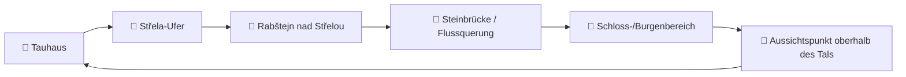

# 🌲 Tauhaus-Runde: Fluss, Aussicht & Geschichte

> **Start & Ziel:** Tauhaus, Rabštejn nad Střelou 72, Manětín  
> **Dauer:** 90–120 Minuten  
> **Stil:** Rundtour mit Flussnähe, Aussicht und historischen Stopps  
> **Ziel:** Direkt ab Tauhaus starten und dort wieder enden ✅

## 🗺️ Kartenübersicht

## 📍 Wegpunkte

| # | Wegpunkt | Charakter | Zeit ab Start |
|---|---|---|---|
| 1 | 🏡 Tauhaus | Start am Haus direkt am Fluss | 0 min |
| 2 | 🌊 Střela-Ufer | Ruhiger Flussabschnitt, Natur | 10–15 min |
| 3 | 🏘️ Rabštejn nad Střelou | Historischer Ortskern | 25–35 min |
| 4 | 🌉 Steinbrücke / Querung | Flussüberquerung mit historischem Flair | 35–45 min |
| 5 | 🏰 Zámek / Burgbereich | Historische Anlage über dem Tal | 45–65 min |
| 6 | 👀 Aussichtspunkt | Weitblick ins Tal und über die Hügel | 65–90 min |
| 7 | 🏡 Tauhaus | Rückkehr zum Start | 90–120 min |

## 🧭 Routenvorschlag

1. Vom **Tauhaus** zunächst hinunter zur **Střela**.
2. Am Ufer entlang in Richtung **Rabštejn nad Střelou**.
3. Durch den historischen Ortsbereich zur **Steinbrücke**.
4. Danach weiter zum **Schloss-/Burgenbereich**.
5. Den Rückweg über einen **höheren Weg mit Aussicht** wählen.
6. Wieder zurück zum **Tauhaus**.

## 🏛️ Historische Details

- **Rabštejn nad Střelou** ist ein historischer Ort mit mittelalterlichen Wurzeln und zählt zu den kleinsten historischen Städten Tschechiens. [web:53]
- Die Anlage umfasst **Burgreste**, ein **barockes Schloss**, eine **Kloster- und Kirchenhistorie** sowie eine markante **Steinbrücke** über die Střela. [web:53]
- Das **Tauhaus** beschreibt sich selbst als Haus am Fluss mit privatem Zugang zur **Střela** und als Ort mit enger Verbindung von Haus, Garten, Fluss und Umgebung. [web:59][web:30]
- Die Region um **Manětín / Rabštejn** eignet sich für kurze Rundtouren mit Natur und Kultur. [web:37][web:54]

## ✅ Hinweise

- Die Route ist als **individuelle Rundtour** gedacht.
- Start und Ziel bleiben **immer Tauhaus**.
- Für 90–120 Minuten ist die Schleife bewusst kompakt gehalten.
